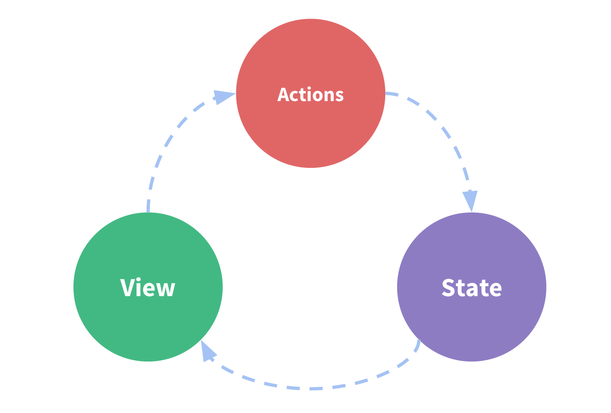

# Overview

> What you will learn
> * What R3dux is and why you might want to use it
> * Key R3dux terms and concepts
> * How data flows through a R3dux app

## Introduction


## R3dux Terms and Concepts

Before we dive into some actual code, let's talk about some of the terms and concepts you'll need to know to use R3dux.

### State Management

Let's start by looking at a small Blazor counter component. It tracks a number in component state, and increments the number when a button is clicked:

```C#
<!-- View: the UI definition -->
<div>
    Value: @counter <button onClick="Increment">Increment</button>
</div>

@code {
    // State: a counter value
    private int counter = 0;
    
    // Action: code that causes an update to the state when something happens
    private void Increment()
    {
        counter = counter + 1;
    }
}
```

It is a self-contained app with the following parts:

* The **state**, the source of truth that drives our app;
* The **view**, a declarative description of the UI based on the current state
* The **actions**, the events that occur in the app based on user input, and trigger updates in the state

This is a small example of **"one-way data flow"**:

* State describes the condition of the app at a specific point in time
* The UI is rendered based on that state
* When something happens (such as a user clicking a button), the state is updated based on what occurred
* The UI re-renders based on the new state



However, the simplicity can break down when we have multiple components that need to share and use the same state, especially if those components are located in different parts of the application. Sometimes this can be solved by ["using cascading values and cascading parameterslifting state up"](https://chrissainty.com/understanding-cascading-values-and-cascading-parameters/) to parent components, but that doesn't always help.

One way to solve this is to extract the shared state from the components, and put it into a centralized location outside the component tree. With this, our component tree becomes a big "view", and any component can access the state or trigger actions, no matter where they are in the tree!

By defining and separating the concepts involved in state management and enforcing rules that maintain independence between views and states, we give our code more structure and maintainability.

This is the basic idea behind R3dux: a single centralized place to contain the global state in your application, and specific patterns to follow when updating that state to make the code predictable.
